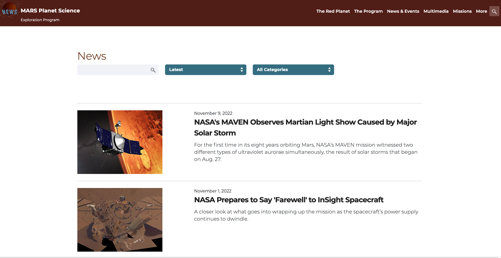
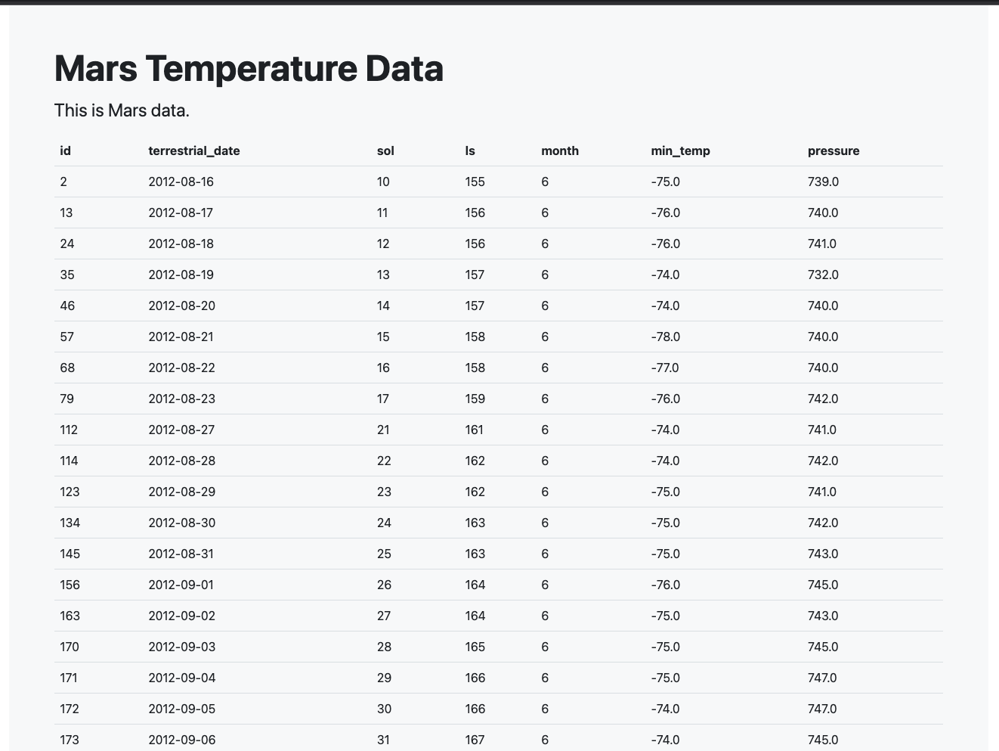
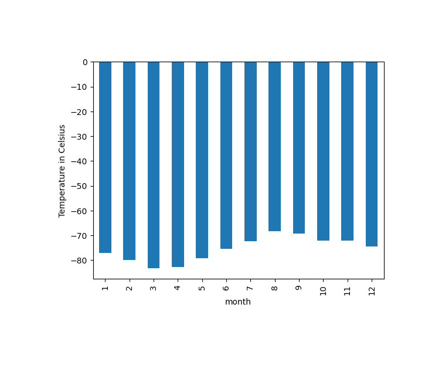
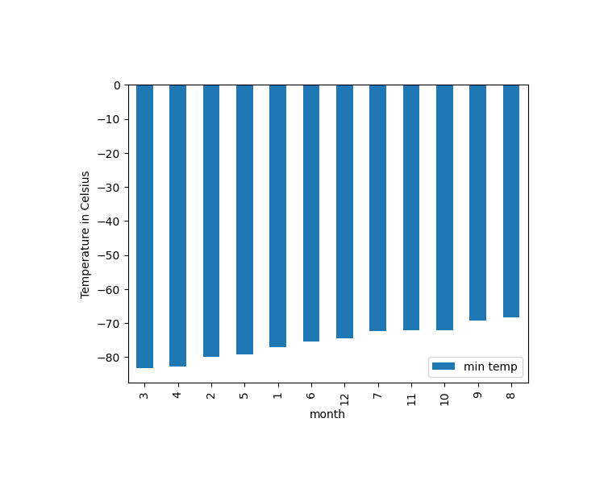
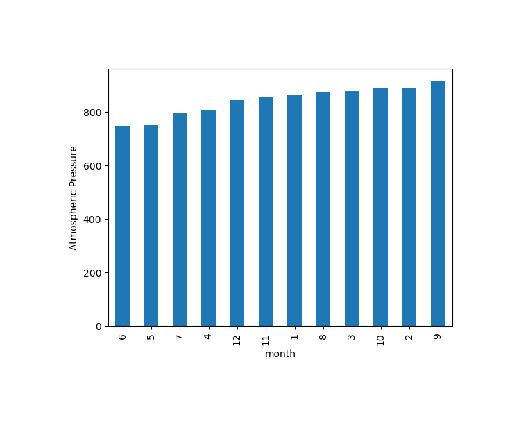
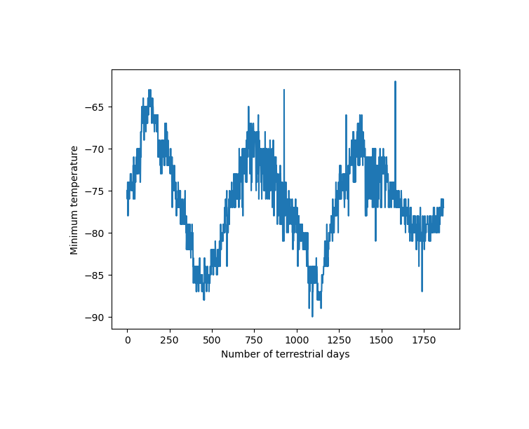

# Web Scraping Challenge
Columbia University Bootcamp Week 11 Challenge  

## About 
In this project, we explore the power of Python by Web Scraping Websites and gathering data using splinter's browser and bs4's BeautifulSoup.  
Using HTML components, data was gathered, further analyzed and visualized, to get a better grasp of the information. 
To carry the aforementioned tasks, pandas and matplotlib were also utilized.  
This project uses two websites to gather data:  

  
[Mars News Website](https://static.bc-edx.com/data/web/mars_news/index.html)   

[Mars Temperature Data](https://static.bc-edx.com/data/web/mars_facts/temperature.html) 
### Mars News Articles
In the Mars News Website, the article titles and preview text were extracted from every article.  
The information that was scraped from every article was exported into a JSON file (This file can be found in the Files folder). 

### Mars Temperature Data
In the Mars Temperature Website, the components from an HTML table were extracted using a python loop.  
The data was then converted into a Data Frame using pandas.  
The information was further analyzed using pandas aggregate functions.  
Finally, the results were visualized.  

## Table of Contents
[Installation](#installation)  
[Visualization](#visualization)   
[Acknowledgements](#acknowledgements)  

## Installation 
    1. Clone repository on your local machine
    2. Open Jupyter Notebook 
    3. Open .ipynb file
    4. Run all cells
  

## Visualization

  
 
 
  

## Acknowledgements

* How to export a JSON file: [Stack overflow](https://stackoverflow.com/questions/12309269/how-do-i-write-json-data-to-a-file)  
* Looping through an HTML table: [Data Science Central](https://www.datasciencecentral.com/how-to-use-python-to-loop-through-html-tables-and-scrape-tabular-data/)  

